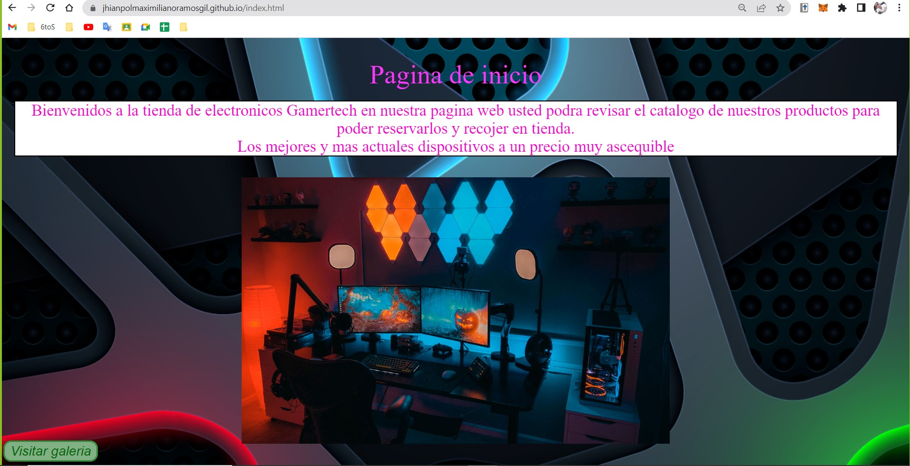
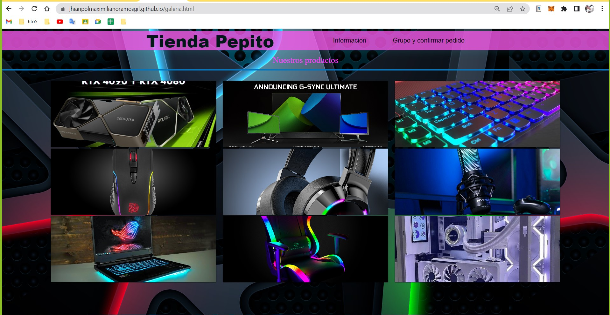
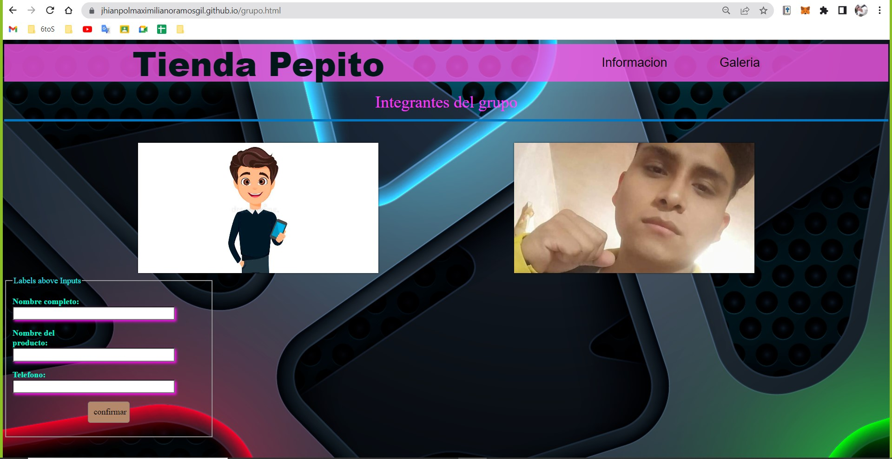
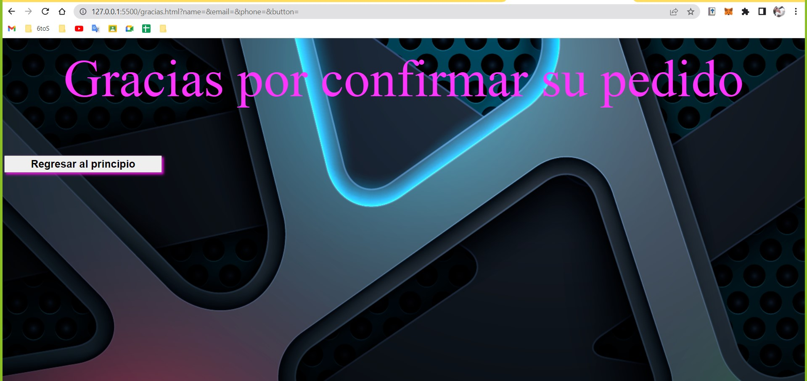

#  Tienda Pepito básico 
Frontend implementado con puro html y css, img, con la intención de aplicar conocimientos básicos de html y css, eligiendo un proyecto de tienda de productos electrónicos. 

**Página Inicio**
- Consta de una vista principal, pagina de inicio con una breve descripción.

**Visitar Galeria**
- Consta de un enlace de referencia al cual lleva el nombre de  "Visitar Galeria".
- Al hacer click en "Visitar Galeria" nos muestra una breve galeria de imagenes electrónicas con un  diseño.

**Grupo y confirmar pedido**
- Consta de un enlace de referencia que lleva por nombre "Grupo y confirmar pedido"
- Al hacer click en "Grupo y confirmar pedido" podremos apreciar un formulario básico y foto con diseño y estilos de nombres de los miembros.

**Confirmar Pedido**
- Se muestra una vista simple con un texto Gracias por confirmar su pedido
- Se muestra un enlace de referencia que lleva por nombre regresar, lo que hace es redirigirte a la pagina principal

